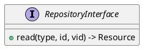

```plantuml
@startuml
Interface RepositoryInterface {
	+ read(type, id, vid) -> Resource
}
@enduml
```

## read
Resource n'existe pas -> Exception -> 404
Version n'existe pas -> Exception -> 404

Resource supprimée -> Exception -> 410
Resource supprimée à cette version -> 410
