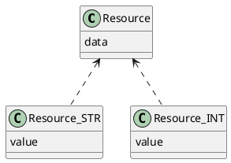
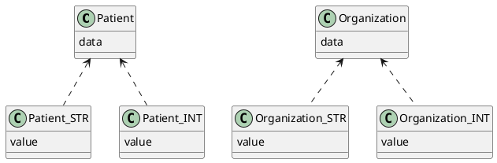

## HAPI FHIR
**JAVA**
**SQL**
* Une table avec toutes les ressources *compressées*
* Des tables d'index
		On extrait les valeurs sur lesquelles  on va effectuer des recherches
* Des index sur les index



**Avantages :**
* Purement SQL (implémentable sur tout SGBD relationnel)
* Implémentation des recherche simple

**Inconvénients :**
* Duplication de la donnée (double index -> 3 fois la même donnée)
* Grandes jointures et CTE

## Aidbox (Health Samurai)
**GO ?**
**PostgreSQL**
Utilisation d'une BDD avec la recherche sur des documents.

Ici PostgreSQL fait des recherches sur des champs BJSON (JSON binaires)

Utilisation d'une table par ressource (découpe de la quantité de données) (on sait *généralement* sur quelle donnée on effectue la recherche)

## icanbwell
https://github.com/icanbwell/fhir-server?tab=readme-ov-file
**Javascript**
**MongoDB**

Utilisation de MongoDB -> stockage des documents directement
Utilise le model de ressources HAPI

**Avantages :**
* Très rapide
* Implémentation facile

**Inconvénients :**
* Pas de transaction
* Besoin de traduire FHIRPath en chemin Mongo (Ici tous les SearchParameters sont écrits en dur avec les chemins -> on ne peut pas ajouter de SearchParam à la volée)

**SearchParameter mail :** `Patient.​telecom.​where(system='email')`
**Conversion :**
```js
email: new SearchParameterDefinition({
	type: 'token',
	field: 'telecom',
	fieldFilter: '[system/@value=\'email\']'
})
```

## Firely
https://github.com/FirelyTeam/spark
**C#**
**MongoDB**

## Microsoft
https://github.com/microsoft/fhir-server
**C#**
Semble similaire à *HAPI FHIR*

## LinuxForHealth (IBM)
https://github.com/LinuxForHealth/FHIR
**Java**
Architecture similaire à HAPI

* Une table par type de ressource
* Une table par type d'index et de ressource


