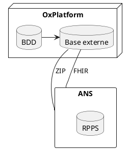
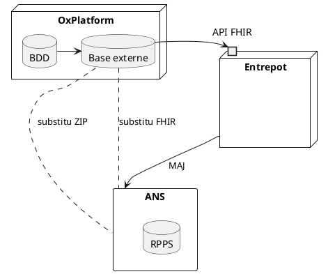
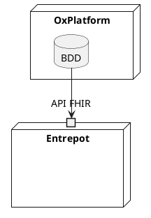
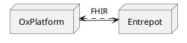

# Annuaire RPPS

https://interop.esante.gouv.fr/ig/fhir/annuaire/index.html
https://ansforge.github.io/annuaire-sante-fhir-documentation/
https://ansforge.github.io/annuaire-sante-fhir-documentation/pages/changelog/changelog.html

## Cahier des charges

**Version FHIR** : R4

**Espace nécessaire** : <10 Go

**Ressources** *profilées* :
- Practitioner
- PractitionerRole
- Organization
- Person - *non utilisé par OX*
- HealthCareService - *non utilisé par OX*
- Device - *non utilisé par OX*
 
Une dizaine de SearchParameter (Elements de recherche)

## Utilisations

L'utilisation de l'annuaire (et donc des types de requête utilisées) dépend des quelques cas d'usage de celui-ci.

Son cas d'usage dépend d'où se trouve l'entrepôt dans le processus de mis à jour de l'information.

**Rappel de l'architecture actuelle** et en prévision de la version en production de l'annuaire RPPS FHIR par l'ANS.

### Réplicat direct de l'annuaire RPPS

Ici l'entrepôt ne serait utilisé que pour les mises à jour régulières.

Par exemple :  Mise à jour de la base externe de OxPlatform

* Il se mettrait à jour lui-même grâce à l'API de l'ANS
* Détient théoriquement exactement les mêmes données que l'API de l'ANS
* Est le point de référence pour les instances OxPlatform afin qu'ils mettent à jour leur base externe
* En cas d’entrepôt hors service, l'instance peut se base sur l'API de l'ANS

Aujourd'hui les mises à jour de la base externe se font une fois par **semaine** et toute la base est mise à jour. Chaque instance télécharge un fichier de **plusieurs GB**.
Avec une API FHIR, les mise à jour pourraient s'effectuer à très grande fréquence (toutes les **heures**, voire moins) avec **uniquement les données changées**.
On n'utiliserai alors que la recherche par date de modification *_lastUpdated*

#### Fonctionnalités principales
* Création de token pour gérer les consommateurs de l'entrepôt
* Gestion utilisateur administrateurs pour gérer les synchronisations
* Appels récurrents à l'API FHIR de l'ANS pour mettre à jour ses propres données
	* Possibilité d'envoyer et de recevoir des échanges FHIR
	* Système d'UPDATE FHIR
* Traiter les requêtes de mise à jour des instances
	* Traiter les spécificités des requêtes HTTP FHIR
	* GET/POST sur les quelques types de ressource mises à disposition
	* paramètre *\_lastUpdated*
	* paramètre *\_include* et *\_revinclude* 
* Pagination

#### Fonctionnalités secondaires
* Paramètre *_include:iterate* pour synchronisations moins coûteuses
* Subscription : l'entrepôt envoie les mise à jour
* Bulk Export : En cas de nouvelle instance -> descendre tout l'entrepôt
* Bulk Import : Nouvelle instance d'un entrepôt
* En cas de service de Subscription de l'API ANS
	* Gérer les droits de création et mise à jour sur les ressources
	* Gérer les requêtes

#### Spécificités
* Pas besoin dans ce cas-ci d'effectuer de recherche
	* Pas de SearchParameters
	* Pas d'index de recherche

### Remplacer la base externe
On pourrait ensuite remplacer la base externe et la mise à jour de la base interne de Ox-Platform se ferait uniquement grâce à l'entrepôt.
*Je n'ai pas actuellement connaissance de la fréquence de mise à jour de la BDD par rapport à la Base externe*

### Utilisation "Online"
* Une utilisation de l’entrepôt en temps réel.
* On ne mettrai pas à jour nos données en interne, on utiliserai directement l'API.
* Ce qui veut dire que l'on a besoin de faire des recherche directement via des numéros RPPS ou des nom de professionnels.
* On a besoin ici de hautes performances en recherche.
* Recherches FULL TEXT sur le nom de praticiens

#### Fonctionnalités
* Recherche
	* Search (GET/POST)
	* Gestion des SearchParameter
		* Utilisateurs autorisés à la gestion des SP
		* Modifier de SearchParameters
	* Index optimisés pour SP
	* Index FULLTEXT

## Conclusion
**Une petite quantité de données.**

**Besoin d'une forte disponibilité**
Il a pour but d'être la référence de beaucoup d'instances pour :
* **Dans un premier temps** 
	* mise à jour très régulières (freq : 30m - 1h)
	* requêtes simples
* **Accès "online"** (sans réplication de données)
	* constamment sollicité
	* recherches précises

