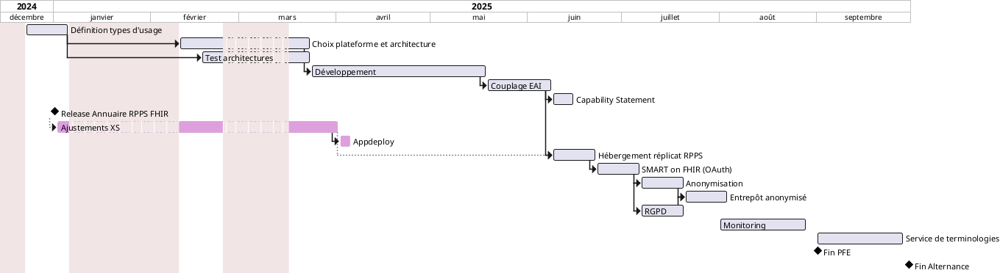

```plantuml
@startgantt
'!theme carbon-gray
skinparam backgroundColor white
skinparam roundCorner 4
language fr
printscale monthly zoom 4
Project starts 2024-12-15

2024-11-11 to 2024-12-22 is closed
2025-01-06 to 2025-02-09 is closed 
2025-02-24 to 2025-03-16 is closed

[Définition types d'usage] as [Def] starts 2024-12-23 and requires 2 weeks

[Def]->[Choix plateforme et architecture]
[Choix plateforme et architecture] requires 3 weeks
[Test architectures] starts 1 working weeks after [Def]'s end and requires 2 weeks

[Développement] requires 8 weeks
[Choix plateforme et architecture]->[Développement]
then [Couplage EAI] requires 3 weeks
[Couplage EAI]->[Capability Statement]
[Capability Statement] requires 1 week

[Release Annuaire RPPS FHIR] happens at 2025-01-01
[Release Annuaire RPPS FHIR]-[dotted]->[Ajustements XS]
[Ajustements XS] ends at 2025-04-01
[Ajustements XS] is colored in Plum
then [Appdeploy] requires 4 day
[Appdeploy] is colored in Plum

[Hébergement réplicat RPPS] as [RPPS] requires 2 weeks
[Ajustements XS] -[dotted]-> [RPPS]
[Couplage EAI]->[RPPS]

[SMART on FHIR (OAuth)] as [SMART] requires 2 weeks
[RPPS]->[SMART]
[SMART]->[Anonymisation]
[Anonymisation] requires 2 weeks
then [Entrepôt anonymisé] requires 2 weeks

[RGPD] requires 2 weeks
[RGPD] starts after [Anonymisation]'s start
[RGPD]->[Entrepôt anonymisé]

[Monitoring] starts at 2025-08-01 and requires 4 weeks
[Service de terminologies] as [Termino] requires 4 weeks
[Termino] starts at 2025-09-01

[Fin PFE] happens at 2025-09-01
[Fin Alternance] happens at 2025-09-30

hide footbox

@endgantt
```

