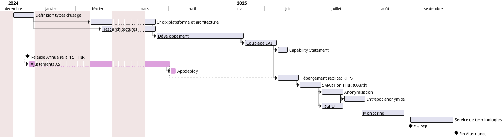

# Gestion PFE

## Diagramme de Gantt prévisionnel

## Grands axes

### Composante Organisationnelle
* Définir l'investissement en jour/homme
* Organisation temporelle des tâches (gantt) 
* Définiton du process de dev
* DSO / déploiement
    * Industrialisation (CI/CD)
    * Intervention équipe infra / devops / consulting (paramétrage/formation)

Comment organiser le projet en fonction des tâches et de l'effectif qui lui sera attribué

### Composante économique

Voir avec l'équipe commerciale

* En quoi l'entrepôt est-il un produit viable ?
* Quel est son coût ? (Jour/hommes)
* Etude du marché :
    * Qui seront les potentiels clients ?
    * Quel sera le taux d'acquisition / combient de ventes ?

* Axe Produit
    * Analyse du besoin de l'utilisateur / client (stockage/standardisation/interop/épidémio/BI)
    * Valeur apportée par le produit
    * Définit KPI de mesure de cette valeur (ex: adoption, volume de données traité,...)
* Axe "sales"
    * Modèle économique
    * Estimation revenus
* Axe business général et stratégie
    * Investissement <-> produit
    * Innovation
    * Impact image de marque - notoriété
    * Positionnement marché

Présentation de projet VP